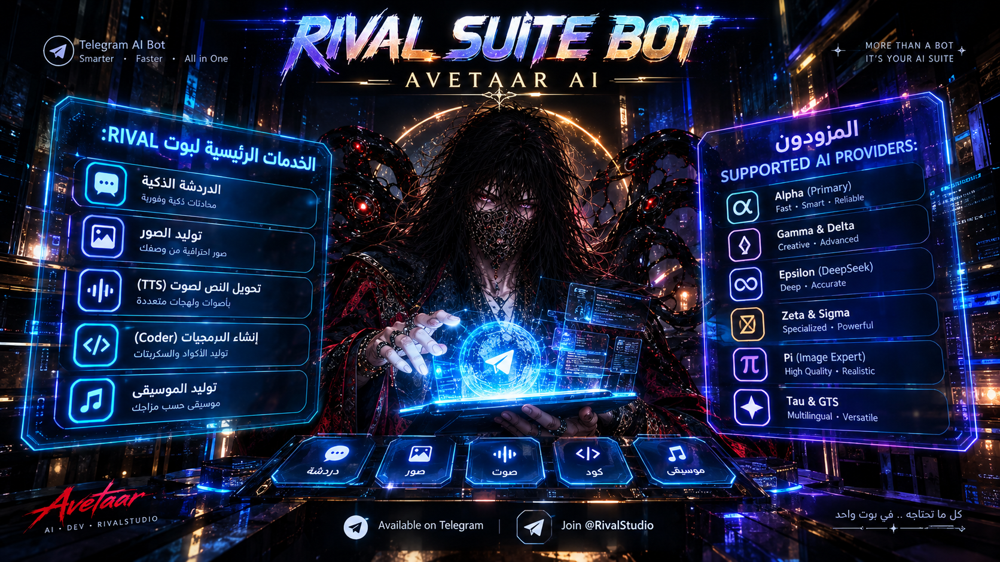

<p align="center"></p>

# RIVAL Suite Bot

**الإصدار:** 0.1  •  **المطوّر:** Avetaar (@Avetaar)  •  **الفريق:** Rival

---

## 🇸🇦 العربية

RIVAL Suite Bot هو **مساعد ذكي على التلغرام** — تستخدمه بأزرار بس، بدون ما تكتب أي أمر.
بوت واحد يقوم بكل شي بدالك: 💬 محادثة، 🖼️ صور، 🔊 صوت، 🎵 موسيقى، 🌐 ترجمة — كل شي في مكان واحد.

### ✨ مميزات البوت

- 💬 **محادثة** — اسأل عن أي شي، اطلب منه يكتب أو يشرح، يناقشك ويجاوبك
- 🖼️ **صور** — امل أي شي ببالك ويرسمه، عدّل الصور، شيل الخلفية من أي صورة
- 🔊 **صوت** — حوّل أي نص لصوت واضح بصوت طبيعي
- 🎵 **موسيقى** — ولّد موسيقى بأي نوع تبيه
- 🌐 **ترجمة** — 18 لغة، البوت يشوف اللغة من وحدة ويترجمها
- 📊 **73 نموذج جاهز** شغالين على كل هاي الخدمات
- 📎 **نتائج فورية** — الصور والصوت توصلك ملفات جاهزة، مو بس روابط
- 🔒 **حماية ذكية** — أي مستخدم محظور أو بوت مغلق ينقطع تلقائيا من عنده
- 🔁 **تعافٍ ذاتي** — لو انقطع الاتصال البوت يعالج نفسه من وحدة بدون ما توقف
- ⚙️ **لوحة تحكم** — للمالك بس: فتح وإغلاق البوت، حظر مستخدمين، مسح بيانات، إحصائيات
- 🏃 **يعمل على كل شي** — Termux، لينكس، ماك، ويندوز، أي استضافة

### 🚀 التثبيت — أمر واحد

حمّل الملفات، افتح الطرفية (الترمينال) بجوار فولدر البوت، وشغّل:

**Termux / لينكس / ماك:**
```
./install.sh
```

**ويندوز:**
```
install.bat
```

راح يسألك 3 أشياء:
1. توكن البوت
2. يوزر البوت (بدون @)
3. أيدي المطوّر (المالك)

بعد كذا البوت يشتغل لحاله. التوكن يخلص بمفصل منفصل مو بالكود — خلّه سرّي، لا تشاركه ولا ترفعه أي مكان.

**إيقاف البوت:** Ctrl+C
**تشغيل ثاني:** شغّل نفس الأمر مرة ثانية

---

## 🇬🇧 English

RIVAL Suite Bot is a **smart assistant on Telegram** — you use it only by pressing buttons, no commands to type.
One bot does everything for you: 💬 chat, 🖼️ images, 🔊 voice, 🎵 music, 🌐 translation — all in one place.

### ✨ Bot Features

- 💬 **Chat** — ask about anything, ask it to write or explain, it talks with you and answers
- 🖼️ **Images** — picture anything in your head and it draws it, edit images, remove backgrounds
- 🔊 **Voice** — turn any text into a clear, natural-sounding voice
- 🎵 **Music** — generate music in any style you want
- 🌐 **Translate** — 18 languages, the bot detects the language on its own and translates
- 📊 **73 ready models** working across all of these services
- 📎 **Instant results** — images and audio arrive as ready files, not just links
- 🔒 **Smart protection** — banned users or a closed bot are cut off automatically
- 🔁 **Self-healing** — if the connection drops, the bot fixes itself without you stopping it
- ⚙️ **Control panel** — owner only: open/close the bot, ban users, wipe data, stats
- 🏃 **Runs on everything** — Termux, Linux, macOS, Windows, any hosting

### 🚀 Install — One Command

Download the files, open a terminal next to the bot folder, and run:

**Termux / Linux / macOS:**
```
./install.sh
```

**Windows:**
```
install.bat
```

It will ask three things:
1. The bot token
2. The bot username (without the @)
3. The developer's ID (the owner)

After that the bot runs on its own. The token is stored in a separate file, not in the code — keep it private, never share it or upload it anywhere.

**Stop the bot:** Ctrl+C
**Run again:** rerun the same command

---

## 📢 Short description (channels / GitHub)

**AR:**
```
RIVAL Suite Bot — مساعد ذكي بالتلغرام، تستخدمه بأزرار بس. محادثة، صور، صوت، موسيقى، ترجمة في بوت واحد. 73 نموذج جاهز، حماية ذكية، تعافٍ ذاتي. يعمل على Termux/لينكس/ماك/ويندوز/أي استضافة.
⚡ تثبيت بأمر واحد: ./install.sh (أو install.bat)
🛠 المطوّر: Avetaar (@Avetaar) | فريق: Rival
```

**EN:**
```
RIVAL Suite Bot — a smart Telegram assistant, all buttons. Chat, images, voice, music and translation in one bot. 73 ready models, smart protection, self-healing. Runs on Termux/Linux/macOS/Windows/hosting.
⚡ One-command install: ./install.sh (or install.bat)
🛠 Developer: Avetaar (@Avetaar) | Team: Rival
```
